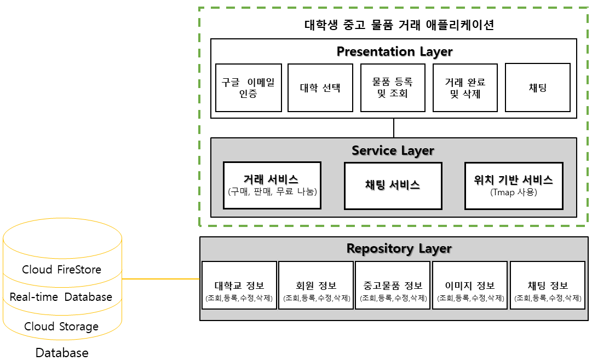
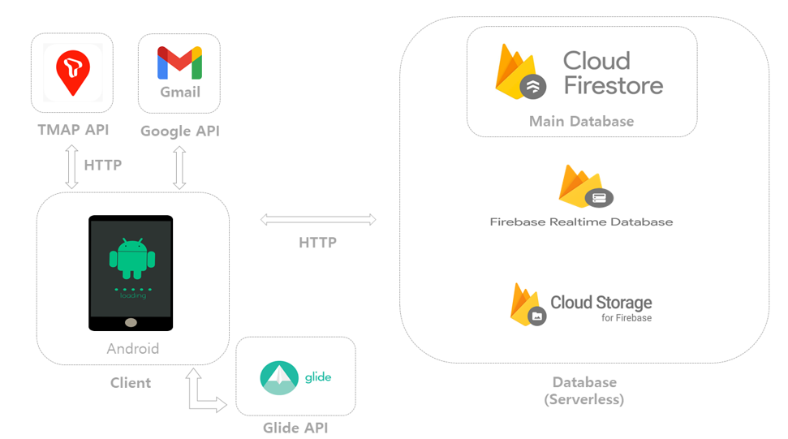

# 2022-1_Final_project

## 개요
2022 종합프로젝트 12분반 1팀
이승현, 최도원, 이정빈, 김도훈

## 주제
파이어베이스를 이용한 대학생 중고거래 안드로이드 애플리케이션

## 졸업 논문
본 프로젝트는 한국정보처리 학회에서 주관하는 ACK 2022(추계) 학술발표대회 논문집(제29권 제2호)에 등재되었습니다. 
링크: [http://kips.or.kr/bbs/confn/article/2484](http://kips.or.kr/bbs/confn/article/2484)

## 소프트웨어 모델링

## 시스템 구성도
